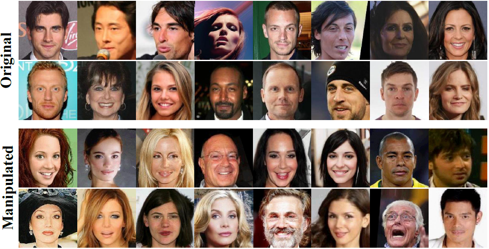

# Blind Detection of Glow-based Facial Forgery

Zhiqing Guo<sup>1</sup>, 
Lipin Hu<sup>1</sup>,
Ming Xia<sup>2</sup>,
and Gaobo Yang<sup>1</sup></br>
<sup>1</sup> Hunan University, China; 
<sup>2</sup> Southwest Minzu University, China</br>



## Glow-based Fake Face (GFF) dataset
The CelebA dataset is a large-scale face attributes dataset with large diversities including 10,177 number of identities and more than 200K face images.
Glow is a generative flow for photo-realistic facial expression synthesis, which can change face attributes to different expressions.
In our paper, we exploit the Glow model and the CelebA face image dataset to construct the GFF dataset.
Please consult our [paper](https://www.researchgate.net/publication/345040451_Blind_detection_of_glow-based_facial_forgery) for more information.

## GFF dataset terms
Please agree to the following terms of use before we provide you with access to the GFF dataset.
* Researchers can only use the GFF dataset for non-commercial research and educational purposes.
* Researchers take full responsibility for their use of the dataset, and protect the dataset providers from any and all claims arising from the use of the dataset by researchers.
* Researchers can provide others with access to the dataset if they agree to accept the terms of use.
* We reserve the right to terminate researchers' access to the dataset at any time.

## Download
If you agree to the above 'GFF dataset terms' and would like to download the GFF dataset, please answer the following questions and send them to us at [guozhiqing@hnu.edu.cn](mailto:guozhiqing@hnu.edu.cn).
* Name
* Affiliation
* Principal Investigator/Advisor's Name and Email
* Research purpose

## Citation
Please cite our paper if the GFF dataset is used in your research:
```
@article{article,
author = {Guo, Zhiqing and Hu, Lipin and Xia, Ming and Yang, Gaobo},
year = {2020},
month = {10},
pages = {1-24},
title = {Blind detection of glow-based facial forgery},
journal = {Multimedia Tools and Applications},
doi = {10.1007/s11042-020-10098-y}
}
```
